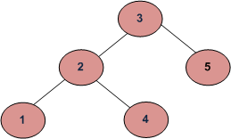

# Determine if a Binary Search Tree is valid

Write a method on a `BinarySearchTree` class called `isValid`. This method should take in a root node and returns a boolean that represents whether the Binary Search Tree is valid or not.

Notes:
A binary search tree (BST) is a node based binary tree data structure which has the following properties:

- The left subtree of a node contains only nodes with keys less than the node’s key.
- The right subtree of a node contains only nodes with keys greater than the node’s key .
- Both the left and right subtrees must also be binary search trees.

Example:


For the tree above:

```js
let bst = new BinarySearchTree();
bst.insert(4);
bst.insert(2);
bst.insert(5);
bst.insert(1);
bst.insert(3);

bst.isValid();
//True
```



For the tree above:

```js
let bst = new BinarySearchTree();
let node3 = new BSTNode(3);
let node2 = new BSTNode(2);
let node5 = new BSTNode(5);
let node6 = new BSTNode(1);
let node4 = new BSTNode(4);

bst.root = node3;
bst.root.right = node5;
bst.root.left = node2;
bst.root.left.left = node1;
bst.root.left.right = node4;

bst.isValid();
//False
// Node with val of 4 should be on the right of the root node.
```

If you would like a guided walkthrough to this problem, the following video is an excellent resource.

[Binary Search Tree isValid Walkthrough](https://www.youtube.com/watch?v=dB9aikwZttY&t=698s)

Companies that have asked this question: -
